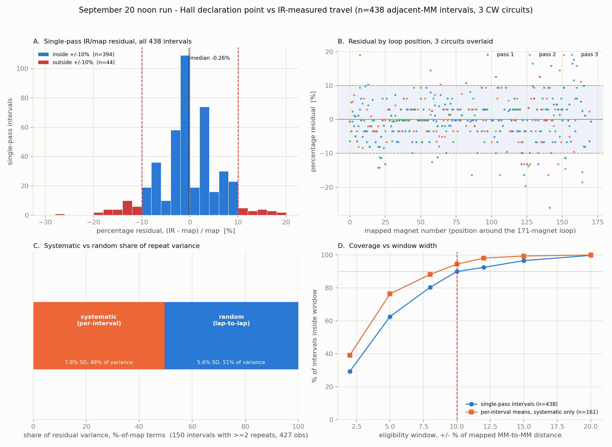

# Spatial variability of Hall magnet declaration points vs IR-measured travel

## Scope and conclusion

This analyzes the September 20 noon run — the only dataset in the repository
where Hall magnet declarations and IR wheel travel can be jointly aligned at
usable quality. It does not recalibrate IR against the map, and it does not
assume the mapped magnet center and the Hall declaration point are the same
physical location; that assumption is exactly what is being tested.

About half of the single-pass IR/map spread is a **systematic, per-interval**
offset that repeats lap to lap (49.6% of repeat variance, pooled SD 23.2 mm);
the other half is **random**, changing lap to lap at the same interval (50.4%,
pooled SD 17.1 mm). Two clean tests for a **per-magnet** declaration-position
effect — correlating adjacent interval residuals across magnets, and
correlating residual against the declaring event's own peak/contrast/shape/
polarity — both come back null. The systematic component is real and
repeatable, but nothing here pins it on the Hall detector rather than on
map-spacing error; the random component is close in size to what known IR
count-quantization and clock-alignment jitter alone would produce. **A flat
±10% eligibility window, applied as a hard single-pass gate, would have
rejected 44 of 438 (10.0%) of this run's own accepted, physically ordinary
single-pass traversals**, including 9 of 161 intervals whose lap-averaged
(systematic-only) residual still exceeds 10% after random noise is averaged
out. The requested "after the two-sample rule" comparison (objective 6) could
not be run: no dataset exists where that rule produced a usable Hall-declared
sequence with paired IR.

## Data source and firmware provenance

Analyzed run: `field-records/logs/20260920_ir_noon_capture.log` (IR, sender
boot `e4410597`) paired with `field-records/logs/20260920_toby_noon_capture.log`
(Hall/MQTT), the same capture documented in `IR_NOON_RUN_ANALYSIS_20260920.md`
and `IR_MIXED_LIGHT_LAP_20260920.md` (the latter is an earlier, partial
annotation pass over the identical capture, confirmed by identical Pi-epoch
timestamps — not a second run). 513 consecutive accepted CW `MAGNET` advances,
three circuits of the 171-magnet, 52,150 mm route, 12:11:27–12:23:22 PDT.

Toby's firmware for this run is `NAVI_ONE_STATION_CURVES` (identified from the
`diag/wave_meta` / `schema:"station_curve_v1"` topic unique to that sketch).
Its Hall capture (`HallCapture.h`) **opens** a passage on a single sample
crossing `entryMargin` (38 counts) — immediate, not two-of-two — but the
`mm/marker` advance is not published until the passage **closes** and the
full-waveform shape/residual test runs against it. The alignment method
(inherited from `ir_noon_analysis.py`, see below) uses `diag/wave_meta`'s
`close_ms` as the declaration's physical time, which is therefore the
**trailing edge** of the magnetic field, not the leading edge.

Decision `0088` (2026-09-18) defines a different rule — declare on the second
of two consecutive 1 kHz samples ≥70 counts from baseline, at the **leading**
edge — for `NAVI_SIMPLIFIED` and its `NAVI_IR` descendant. `NAVI_IR 0.1` is the
only firmware ever flashed with that rule that also attempted IR pairing; its
single field session on 2026-09-20 afternoon (13:31–13:39 PDT, a **different**
session from the noon run, sender boot `3B48EBDDC9F3895F`) never produced a
usable Hall-declared MM sequence: dominant `INADEQUATE_CONTRAST` (516 of 535
snapshots), ten `AMBIGUOUS` observations, `RECOVERY_EXHAUSTED`, zero committed
advances after the operator's redeclaration (`NAVI_IR_FIRST_STARTUP_20260920.md`).
**No dataset pairs the two-consecutive-sample rule with valid simultaneous IR.**
Objective 6 is addressed qualitatively below; it cannot be answered from data.

The entire run is CW. No CCW+IR paired dataset exists anywhere in the repo's
field records, so objective 4 (CW vs CCW) also cannot be answered empirically.

## Method

`tools/mm_declaration_spatial_variability.py` reuses `parse_ir()`, `stamp()`,
`quant()`, `stats()`, `TZ` and `NOTES` from `ir_noon_analysis.py` unchanged,
and duplicates (rather than modifies) that script's Hall-side parsing to keep
every marker/wave_meta field the firmware publishes: `peak`, `ratio`, `resid`,
`obs` (polarity), `gap_ms`, and `open_ms`/`close_ms`. Same 150 ms
endpoint-clock-offset gate as the accepted noon audit. **Independent
cross-check:** the reconstructed interval set matches the reviewed
`20260920_ir_noon_analysis.json` exactly — n=438, median ratio 0.9974, p05/p95
0.8861/1.0939, all identical to four decimal places — before any of the new
fields below are added.

Outputs: `field-records/analysis/20260920_mm_declaration_spatial_variability.{csv,json,png}`.
The CSV carries one row per adjacent-MM interval with every field requested:
previous/next declared MM, mapped distance, IR-measured distance, signed and
absolute residual in mm, percentage residual, direction, pass index (1st/2nd/
3rd lap), and both endpoints' peak/ratio/resid/polarity/gap/open-close timing.



## 1. Distribution of IR/map ratios (n = 438 single-pass intervals)

| Statistic | Ratio (IR/map) | Pct. residual | Abs. residual, mm |
|---|---:|---:|---:|
| Mean | 0.9965 | −0.35% | 14.53 |
| SD | 0.0640 | 6.40 pts | 13.01 |
| Minimum | 0.7400 | −26.00% | 0.44 |
| p05 | 0.8861 | −11.39% | 0.79 |
| p25 | 0.9652 | −3.48% | 5.53 |
| Median | 0.9974 | −0.26% | 10.44 |
| p75 | 1.0295 | +2.95% | 20.09 |
| p95 | 1.0939 | +9.39% | 39.40 |
| Maximum | 1.1904 | +19.04% | 78.00 |

Mapped interval lengths in the surviving sample run 280–340 mm (mean 304.5,
median 300 — the full route's 171 intervals run 280–355 mm). The spread is
not small relative to a single interval: p05/p95 already sit outside a ±10%
band before any grouping by interval identity.

## 2. Repeatability across the three circuits — systematic vs. random

161 of the route's 171 CW intervals have at least one surviving pass; 150 have
two or more (427 of the 438 total observations). Ten intervals never survived
the 150 ms gate in any of their 2–3 attempts, and they resolve to five
**specific magnets** rather than ten independent failures: MM81, MM92, MM99,
MM162 and MM168 each knock out both of their adjacent intervals (e.g. MM81
fails both 80→81 and 81→82) because that magnet's own `ir_offset_ms` was
large on **all three** of its declarations — MM81: −525/−191/−495 ms; MM92:
−379/+433/+286 ms; MM99: +264/+313/+312 ms; MM162: −361/−327/+340 ms; MM168:
+205/+222/+159 ms. That consistency across three independent passes (rather
than one bad lap) points to something repeatable at those five physical
locations — most likely an IR motion-snapshot reception gap recurring at the
same point in the route — not to random clock noise. It is flagged here, not
investigated further. Repeat-count histogram over the 161 observed intervals:
127 with all 3 passes, 23 with 2, 11 with 1 (the run starts mid-interval at
MM40–41, so the anchor interval and a few gate casualties fall short of 3).

One-way variance decomposition (ANOVA) restricted to the 150 intervals with
≥2 repeats:

| Component | SD, mm | SD, % of map | Share of variance |
|---|---:|---:|---:|
| Systematic (between-interval, repeats per interval to their own mean) | 23.2 | 7.60 | 49.6% |
| Random (within-interval, lap to lap) | 17.1 | 5.63 | 50.4% |

The three passes show no drift against each other (pct. residual mean/SD:
pass 1 −0.27%/6.37, pass 2 −0.36%/6.51, pass 3 −0.46%/6.37) — the random half
is not a warm-up or end-of-run artifact, it recurs evenly across all three
circuits.

**Reading this for the eligibility window:** the systematic half is, by
definition, the same every time you traverse that specific interval — in
principle learnable and not itself a source of accumulating error if the
window resets per declaration as proposed. The random half is not learnable
per interval; it is the floor on how tight *any* fixed window can be without
routinely rejecting good passes at the noisier intervals.

Classifying the 150 multi-repeat intervals by the noon run's own annotated
route zones (sunny core MM70–155, shaded core MM164 through MM61, else
boundary; `IR_NOON_RUN_ANALYSIS_20260920.md`) gives a baseline mix of 71 sun /
67 shade / 12 boundary. The 20 largest systematic biases (`|mean_pct|`) are
11 sun / 6 shade / 3 boundary — sun and boundary are each modestly
over-represented relative to their share of the data (55% vs. 47% baseline,
and 15% vs. 8%, respectively) and shade is under-represented (30% vs. 45%).
The aggregate numbers agree but are equally modest, not dramatic: mean
|systematic bias| 3.2% (shade) / 4.6% (boundary) / 3.5% (sun); mean
within-interval SD 3.8% / 5.0% / 5.3% respectively. This is a small, one-sided
signal consistent with — but not proof of — some optical-contrast
contribution at lighting transitions (the IR sensor is light-sensitive, the
Hall sensor is not); it is too weak in this single run to treat as
established, see Limitations.

## 3. Do specific magnets consistently declare early or late?

A single lap's per-interval mean residual cannot, by itself, separate a
magnet's declaration offset from that interval's map-spacing error — 171
magnets in a single ring produce exactly 171 edges, so the two effects are
perfectly confounded at the level of one mean per edge (a closed loop has no
spare degrees of freedom). But a real per-magnet offset has a distinguishing
*signature*: it should make the interval ending at magnet `mm` and the
interval starting at `mm` move in **opposite** directions together (a magnet
that declares late shortens the approach and lengthens the departure).
Map-spacing error carries no such prediction, since it is independent
edge-to-edge.

Tested directly: correlate, across the 140 magnets with ≥2 repeats on both
sides, the mean residual of "interval ending at mm" against "interval
starting at mm."

**r = −0.028 (r² = 0.0008), n = 140.** With this n, the standard error on r is
≈0.085 — the observed correlation is indistinguishable from zero. Treating it
at face value anyway implies a per-magnet offset SD of only ≈2.3 mm, and that
number should be read as a noisy upper bound, not a detected effect. **This
run gives no evidence that any specific magnet's declaration point is
consistently early or late relative to its neighbors.** That leaves
map-spacing error (or something route-correlated, like the boundary-zone
pattern in §2) as the more likely source of the systematic half, though this
data cannot fully rule declaration offset out either — see §7.

## 4. CW vs. CCW

Not testable. The noon run is 100% CW (`assert ... dir == 'CW'` holds for all
513 events), and no other repository dataset pairs Hall declarations with
valid simultaneous IR in either direction, let alone both. This is an open
gap, not a negative finding — flagging it rather than forcing an answer.

## 5. Correlation with Hall waveform characteristics

Pearson r between each interval's residual and the declaring events' own
published waveform fields (`peak`, `ratio` = amplitude/threshold, `resid` =
Gaussian shape residual, `gap_ms` = time since the previous event,
`duration_ms` = close_ms − open_ms), n=438 throughout:

| Characteristic (declaring event) | r vs. abs. residual | r vs. signed residual | r vs. pct. residual |
|---|---:|---:|---:|
| next_peak | −0.076 | −0.126 | −0.123 |
| next_ratio | 0.004 | −0.079 | −0.076 |
| next_resid | 0.020 | −0.082 | −0.081 |
| next_gap_ms | −0.149 | 0.036 | 0.038 |
| next_duration_ms | −0.147 | −0.016 | −0.015 |
| prev_peak | −0.099 | −0.066 | −0.064 |
| prev_ratio | −0.022 | −0.021 | −0.020 |
| prev_resid | 0.052 | −0.098 | −0.097 |
| prev_gap_ms | −0.152 | 0.001 | 0.002 |
| prev_duration_ms | −0.154 | −0.003 | −0.002 |
| map_mm | 0.036 | −0.085 | −0.082 |

All correlations are weak (|r| ≤ 0.15, r² ≤ 2.3%). **No field-strength,
contrast, shape-residual, or approach-speed characteristic meaningfully
predicts declaration error in this run.** The largest (still weak) values are
`gap_ms`/`duration_ms` against *absolute* residual (~−0.15): slower passages
(longer duration, larger gap) associate with slightly smaller absolute error
— the direction expected from clock-alignment jitter alone (§7), not
necessarily from anything about the Hall field.

Declared polarity: N events (n=215) mean pct. residual −0.64% (SD 6.26); S
events (n=223) mean −0.08% (SD 6.55). The 0.55-point gap is under one
pooled standard error (~0.61 pts) — not statistically distinguishable from
noise, though a larger sample could resolve it either way.

## 6. Does the two-consecutive-sample rule improve spatial repeatability?

**Cannot be measured.** As established above, this run's declaration point is
the wave-*close* (trailing edge) of `NAVI_ONE_STATION_CURVES`'s HallCapture,
not either the single-sample or two-consecutive-sample *opening* convention.
Decision 0088's rule only ever ran, with IR attached, in `NAVI_IR 0.1`'s one
field session — which produced no usable joint data. There is no before/after
pair to compare.

What this run's own data can bound: the physical separation between the
opening and closing edges of the *same* passage. Open-to-close duration across
all 876 endpoint observations: median 150 ms (p05 130 ms, p95 205 ms, max
632 ms — the last almost certainly the run's documented deliberate final
slowdown). At the run's median local speed (251 mm/s), that is a **≈37.7 mm**
leading-to-trailing-edge separation at the median, **≈51.5 mm** at p95 — 12–17%
of a typical 305 mm interval. This says switching which edge is declared would
move the nominal declaration point by a physically meaningful amount; it says
nothing about whether the opening edge would be *more or less repeatable*
than the closing edge measured here. That remains an open, field-testable
question, not one this dataset can settle.

## 7. How much of the single-interval spread could be declaration position, vs. IR/map error?

Two independent, known, non-Hall error sources, computed from this run's own
numbers:

| Source | Typical size | Basis |
|---|---:|---|
| IR count quantization (±1 pulse) | 3.17% of map (2.84–3.45% range) | 9.652 mm/pulse against 280–355 mm intervals |
| Endpoint clock-alignment jitter → distance | median 9.6 mm, p95 28.5 mm | offset_ms (median 39.9, p95 109.2 ms, gated <150 ms) × each interval's own local speed |

The alignment-jitter figure (median 9.6 mm) is already more than half the
pooled within-interval random SD (17.1 mm) found in §2; combined with
quantization, known IR/timing effects are large enough that **the data cannot
show any of the random component needs to be Hall declaration-position
jitter** — it is fully consistent with being explained by IR counting and
clock alignment alone. Section 3's null offset-correlation result (r=-0.028)
is the second, independent line of evidence pointing the same way: no
detected per-magnet signature. Combined, this analysis finds **no positive
evidence that Hall declaration-position variability is a major contributor**
to the observed spread — but with only 140 magnets' worth of statistical
power on the offset test and a single run to draw the noise-floor comparison
from, a modest contribution (on the order of the ~2.3 mm upper bound in §3)
is not excluded either. The systematic half of the spread (§2) is real and
repeats every lap; this run's evidence favors map-spacing/route-correlated
error over per-magnet Hall offset as its more likely source, but does not
prove it.

## Eligibility window: does the data support ±10%?

| Window | Single-pass intervals inside (n=438) | Interval means inside, systematic only (n=161) |
|---:|---:|---:|
| ±2% | 29.2% (128) | 39.1% (63) |
| ±5% | 62.6% (274) | 76.4% (123) |
| ±8% | 80.4% (352) | 88.2% (142) |
| **±10%** | **89.95% (394)** | **94.41% (152)** |
| ±12% | 92.5% (405) | 98.1% (158) |
| ±15% | 96.6% (423) | 99.4% (160) |
| ±20% | 99.8% (437) | 100.0% (161) |

A flat ±10% window, applied as a hard single-pass gate with the origin reset
at every accepted declaration as proposed, would reject **44 of 438 (10.0%)**
of this run's own accepted, ordinary, non-anomalous single-pass traversals —
not edge cases, just the normal spread documented in §1. Even after averaging
out lap-to-lap noise, **9 of 161 intervals (5.6%)** still have a systematic
residual outside ±10%. Neither the Hall-characteristic correlations (§5) nor
the per-magnet offset test (§3) identify a way to tell those cases apart from
good ones in advance.

**±10% is tighter than this run's own repeatability supports as a
near-universal-acceptance gate.** If the design intent is "reject only the
genuinely anomalous," something in the **±13–15%** range is better justified
empirically (~93–97% single-pass coverage, ~98–99% of the systematic
component). If ±10% is intentionally a tighter, stricter gate — one signal
among several rather than a sole hard veto, deliberately trading recall for
precision — that is a legitimate design choice, but it should be adopted
knowing it will routinely (not rarely) reject about 1 in 10 genuine
single-pass traversals on data like this, and NAVI_COHERENCE's handling of a
rejected-but-real declaration needs to be designed for that rate, not for an
edge case. This is evidence for that decision, not the decision itself; per
standing practice, whatever window is chosen still needs the operator's
ratification (and Sam's, if he weighs in) as its own record.

## Limitations

- Single run, single day, single direction, one speed setting (PWM90), one
  physical car. All findings above are conditional on this run; none of them
  should be treated as a permanent property of the railway without a second,
  independent run to confirm.
- Ten intervals (bracketing magnets MM81, MM92, MM99, MM162, MM168) have zero
  surviving observations at the 150 ms gate; nothing here characterizes them,
  and the five magnets' own repeatable large offsets are worth a follow-up
  look at IR reception around those specific route locations.
- The per-magnet offset test and the Hall-characteristic correlations are
  both null results with real statistical power limits (n=140 magnets, n=438
  intervals) — they say "not detected," not "proven absent."
- The sun/shade/boundary comparison in §2 is suggestive, not conclusive; it
  was not the primary hypothesis going in and deserves a purpose-built check
  (e.g., a run timed to cross a lighting boundary repeatedly) before being
  treated as established.
- Objectives 4 and 6 are open items for lack of data, not resolved.

## Reproduction

```sh
python3 tools/mm_declaration_spatial_variability.py \
  field-records/logs/20260920_ir_noon_capture.log \
  field-records/logs/20260920_toby_noon_capture.log \
  firmware/programs/NAVI_SIMPLIFIED/RouteMap.h \
  --csv-out field-records/analysis/20260920_mm_declaration_spatial_variability.csv \
  --json-out field-records/analysis/20260920_mm_declaration_spatial_variability.json

python3 tools/mm_declaration_charts.py \
  field-records/analysis/20260920_mm_declaration_spatial_variability.csv \
  field-records/analysis/20260920_mm_declaration_spatial_variability.json \
  field-records/analysis/20260920_mm_declaration_spatial_variability.png
```

`tools/mm_declaration_spatial_variability.py` imports `parse_ir`, `stamp`,
`quant`, `stats`, `TZ` and `NOTES` from `ir_noon_analysis.py` without modifying
it; that script remains independently reproducible per its own documentation.
`RouteMap.h` is read only for the identical 171×52,150 mm spacing table shared
by `NAVI_SIMPLIFIED` and `NAVI_ONE_STATION_CURVES` (diffed identical).
