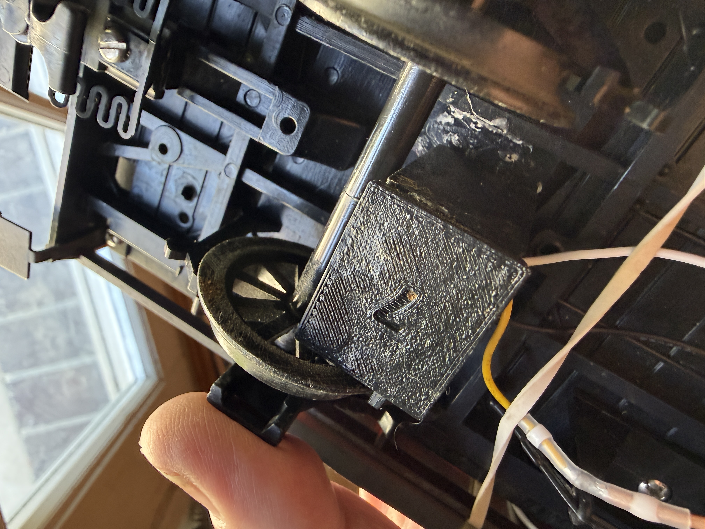

# IR sensor mount — as built

Photographs of the mount actually in service, 2026-08-14. Recorded because
`docs/IR_SENSOR_NOTES.md` contains mount *recommendations* that were never
built, and they had begun to be mistaken for descriptions of the real
hardware.

## What is actually there (operator, 2026-08-14)

- A **3D-printed box**, **glued** in place.
- The sensor is a **tight press fit into the aperture**. The enclosure is
  otherwise **closed** — no weep slot.
- Attached with **double-sided tape**; screwing to the truck is impractical.
- **Virtually no standoff**: the plastic spokes are offset inboard of the
  wheel flange, so the sensor sits very close to the spoke faces.
- No slotted mounting holes.

## Why the near-zero standoff matters

With the sensor this close to spokes that sit inboard of the flange, the
optical path terminates on spoke face rather than running far past the wheel
into the garden. That is consistent with the clean troughs measured on the
black plastic 10-spoke wheel (2026-08-09/10 captures): the inter-spoke gap
behaves less like an aperture aimed at ambient than the earlier geometry did.
Stated as a plausible reading of the measurements, not a controlled result.

## Photographs

| file | view |
|---|---|
| `photos/ir-mount_as-built_01.jpg` | mount and wheel, from below |
| `photos/ir-mount_as-built_02.jpg` | aperture face, sensor press fit visible |
| `photos/ir-mount_as-built_03.jpg` | mount in the chassis, wiring |
| `photos/ir-mount_as-built_04.jpg` | close view past the wheel to the mount |

## Status

No STL or source CAD is committed yet. When it is, it belongs beside this
README, with `*.stl binary` added to `.gitattributes`.
